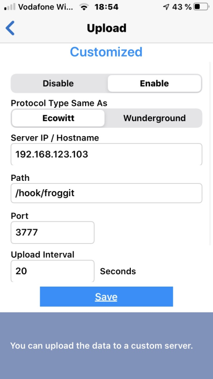
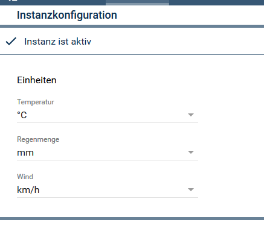

# Froggit
Beschreibung des Moduls.

### Inhaltsverzeichnis

1. [Funktionsumfang](#1-funktionsumfang)
2. [Voraussetzungen](#2-voraussetzungen)
3. [Software-Installation](#3-software-installation)
4. [Einrichten der Instanzen in IP-Symcon](#4-einrichten-der-instanzen-in-ip-symcon)
5. [Statusvariablen und Profile](#5-statusvariablen-und-profile)
6. [WebFront](#6-webfront)
7. [PHP-Befehlsreferenz](#7-php-befehlsreferenz)

### 1. Funktionsumfang

* Empfangen von Daten des DP1500 und ablegen in Variablen.
* Die Kommunikation läuft über das WebHook Control. Die nötigen Einstellungen werde automatisch eingetragen.

### 2. Vorraussetzungen

- IP-Symcon ab Version 5.0

### 3. Software-Installation

* Über den Module Store das 'Froggit'-Modul installieren.(Noch nicht vorhanden)
* Alternativ über das Module Control folgende URL hinzufügen: https://github.com/IPSAttain/Froggit

* In der App muss der "Customized Upload" konfiguriert und aktiviert werden. 
* Protokoll Typ mus Ecowitt sein.
* Dazu die IP-Adresse des IPS Servers angeben. 
* Als "Path" muss /hook/froggit eingetragen werden.
* Port ist 3777 (Standard-Zugangsport IPS)

 

 

### 4. Einrichten der Instanzen in IP-Symcon

 Unter 'Instanz hinzufügen' kann das 'Froggit'-Modul mithilfe des Schnellfilters gefunden werden.  
	- Weitere Informationen zum Hinzufügen von Instanzen in der [Dokumentation der Instanzen](https://www.symcon.de/service/dokumentation/konzepte/instanzen/#Instanz_hinzufügen)

__Konfigurationsseite__:

* In der Instanz können die bevorzugten Einheiten ausgewählt werden.
* Änderungen Übernehmen

 

### 5. Statusvariablen und Profile

Die Statusvariablen werden automatisch angelegt. Werden diese gelöscht, werden sie wieder angelegt. Die Variablen können umbenannt werden.

#### Statusvariablen

* keine

#### Profile

Name   | Typ
------ | -------
Froggit.Rain.Inch  |  float
Froggit.Light.wm2  |  integer
Froggit.Light.fc   |  integer
Froggit.AirPressure.inHg  |  float
Froggit.AirPressure.mmHg..|  float
Froggit.Wind.mph   |  float

### 6. WebFront

* Die Werte werden nur angezeigt, eine Bedienung ist nicht vorgesehen.

### 7. PHP-Befehlsreferenz

* keine