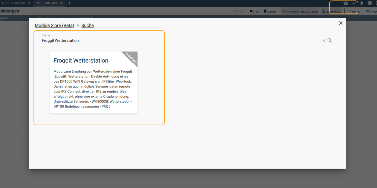
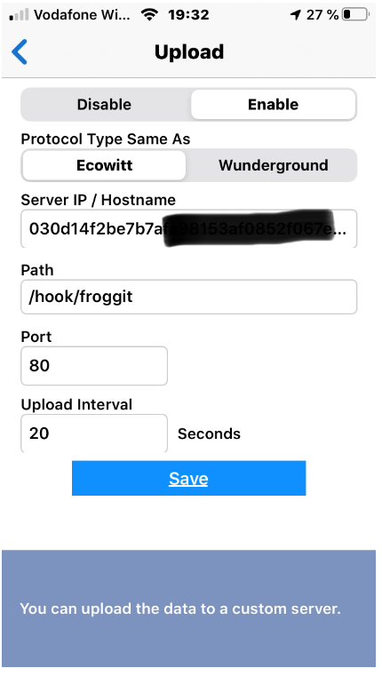
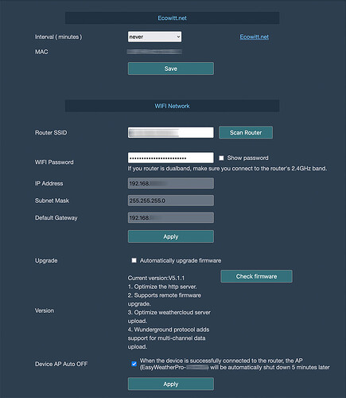
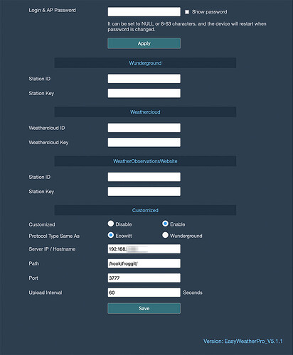

# Froggit Wetterstation

### Inhaltsverzeichnis

1. [Funktion](#1-funktion)
2. [Voraussetzungen](#2-voraussetzungen)
3. [Software-Installation](#3-software-installation)
4. [Einrichten der Instanzen in IP-Symcon](#4-einrichten-der-instanzen-in-ip-symcon)
5. [Statusvariablen und Profile](#5-statusvariablen-und-profile)
6. [WebFront](#6-webfront)

### 1. Funktion

* Empfangen von Daten einer Froggit/Ecowitt Wetterstation und ablegen in Variablen.
* Die Kommunikation läuft über das WebHook Control. Die nötigen Einstellungen werde automatisch vom Modul vorgenommen.

### 2. Vorraussetzungen 

- IP-Symcon ab Version 5.3
- DP1500 Wi-Fi Wetterserver USB-Dongle, Displayeinheit HP1000SE PRO, Sainlogic WS 3500 oder ähnliche
### 3. Software-Installation

* Im Module Store das 'Froggit Wetterstation'-Modul suchen und installieren.

#### 3.1 Konfiguration des  Gaytway per App

* Konfiguriert werden kann das WiFi Gateeway mit der App "WS View". Erhältlich für Android und IOS.
* Im Bereich "Weather Services" muss der "Customized Upload" aktiviert und konfiguriert werden. 
* Protokoll Typ: | Ecowitt
* Server IP: | IP-Adresse des IPS Servers. 
* Path: | /hook/froggit eintragen
* Port: | 3777 (Standard-Zugangsport IPS)
* Wenn mehrere Stationen eingebunden werden sollen, ist jeweils ein Pfad zu definieren. Dieser muss immer mit "/hook/..." beginnen.

 

* Auch ist es möglich, Wetterstationen von außerhalb des eigenen Netzwerkes, über Symcon Connect einzubinden.
* Dazu deine Connect Adresse als Hostname eintragen und Port 80 wählen.

 
 
#### 3.2 Konfiguration des Gateway per Webinterface

* Das Gateway der DP2000 Station hat auch ein eigenes Webinterface
* Display auf Werkseinstellungen zurück setzen, so dass das WLAN-Symbol blinkt
* PC oder Smartphone beim WLAN-Access-Point des Displays anmelden (ab Werk kein Passwort gesetzt)
* Im Browser 192.168.4.1 aufrufen
* Hier kann die Station in das eigene WLAN eingebunden werden.

* Im Bereich "Weather Services" muss "Customized" aktiviert und konfiguriert werden. 
* Protokoll Typ: | Ecowitt
* Server IP: | IP-Adresse des IPS Servers. 
* Path: | /hook/froggit eintragen
* Port: | 3777 (Standard-Zugangsport IPS)

### 4. Einrichten der Instanzen in IP-Symcon

 Unter 'Instanz hinzufügen' kann das 'Froggit'-Modul mithilfe des Schnellfilters gefunden werden.  
- Weitere Informationen zum Hinzufügen von Instanzen in der [Dokumentation der Instanzen](https://www.symcon.de/service/dokumentation/konzepte/instanzen/#Instanz_hinzufügen)

__Konfiguration__:

* In der Instanz können die bevorzugten Einheiten ausgewählt werden.
* Der Pfad zum hook kann eingestellt werden. Damit ist es möglich, mehrere Wetterstationen mit mehreren Instanzen einzubinden. Der Pfad muss immer mit "/hook/..." beginnen!

 

### 5. Statusvariablen und Profile
#### Statusvariablen

* Die Statusvariablen werden automatisch angelegt. 
* Werden diese gelöscht, werden sie wieder angelegt. 
* Die Variablen können umbenannt werden.
#### Profile

Name   | Typ
------ | -------
Froggit.Rain.Inch  |  float
Froggit.Light.wm2  |  integer
Froggit.Light.fc   |  integer
Froggit.AirPressure.inHg  |  float
Froggit.AirPressure.mmHg..|  float
Froggit.Wind.mph   |  float

### 6. WebFront

* Die Werte werden nur angezeigt, eine Bedienung ist nicht vorgesehen.
