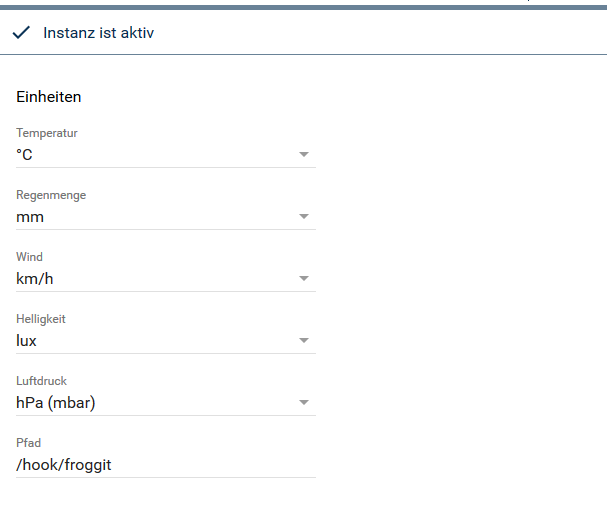

# Froggit Wetterstation

### Inhaltsverzeichnis

1. [Function](#1-function)
2. [Requirements](#2-requirements)
3. [Software-Installation](#3-software-installation)
4. [Create Instances at Symcon](#4-create-instances-at-ip-symcon)
5. [Status Variables and Profiles](#5-status-variables-and-profiles)
6. [WebFront](#6-webfront)

### 1. Function

* Receive data from a Froggit / Ecowitt weather station and store it in variables.
* Communication takes place via the WebHook Control. The necessary settings are made automatically by the module. 

### 2. Requirements 

* IP-Symcon from version 5.3
* Froggit DP1500, Froggit HP1000SE PRO, Sainlogic WS 3500 or similar 

### 3. Software-Installation

* Search for the 'Froggit Weather Station' module in the Module Store and install it. 

* The WiFi gateway must configured with the "WS View" app. Available for Android and IOS.
* "Customized Upload" must be activated and configured in the "Weather Services" area.
* Protocol type: | Ecowitt
* Server IP: | IP address of the IPS server.
* Path: | /hook/froggit
* Port: | 3777 (standard access port IPS)
* If several stations are to be integrated, a path must be defined for each. This must always begin with "/hook/...". 

 

* It is also possible to integrate weather stations from outside your own network via Symcon Connect.
* To do this, enter your Connect address as the host name and select port 80. 

 
 

### 4. Create Instances at IP-Symcon

 Unter 'Instanz hinzufügen' kann das 'Froggit'-Modul mithilfe des Schnellfilters gefunden werden.  
- Weitere Informationen zum Hinzufügen von Instanzen in der [Dokumentation der Instanzen](https://www.symcon.de/service/dokumentation/konzepte/instanzen/#Instanz_hinzufügen)

The 'Froggit' module can be found under 'Add instance' using the quick filter.
- Further information on adding instances in the [documentation of the instances](https://www.symcon.de/en/service/documentation/concepts/instances/)

__Configuration__:

* The preferred units can be selected in the instance.
* The path to the hook can be set. This makes it possible to integrate several weather stations with several instances. The path must always begin with "/hook/..."! 

 

### 5. Status Variables and Profiles
#### Status Variables

* Status variables are created automatically.
* If these are deleted, they will be created again.
* The variables can be renamed. 

#### Profiles

Name   | Typ
------ | -------
Froggit.Rain.Inch  |  float
Froggit.Light.wm2  |  integer
Froggit.Light.fc   |  integer
Froggit.AirPressure.inHg  |  float
Froggit.AirPressure.mmHg..|  float
Froggit.Wind.mph   |  float

### 6. WebFront

* The values are only displayed, operation is not intended. 
